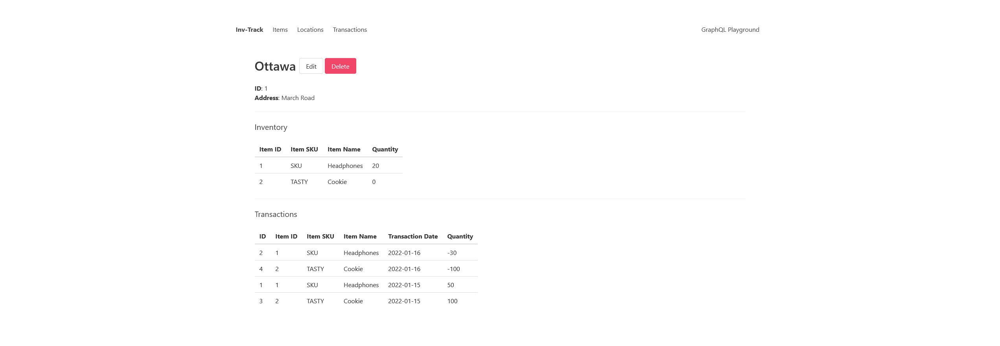

# inv-track
* a simple inventory tracking web application with
  * GraphQL queries, mutations and subscriptions (with Redis PubSub)
  * batching dataloaders (N+1 problem)
  * docker compose for development, test and production
* see [Extensibility](#extensibility) for future improvements
* feature: create locations and assign inventory

## Running
* **note** docker compose v3 is required, but this is the **only** dependency to serve this project (because docker <3)

development: `docker compose up`\
integration tests: `docker compose -f docker-compose.yml -f integration-test.yml up`\
optimized: `docker compose -f docker-compose.yml -f optimized.yml up`
* for production, use the multi-stage build instead located in `./server/Dockerfile.production`

## Using
* using the playground link allows creating GraphQL requests and receiving responses

* using the (very basic) front-end allows for all the basic operations
  * the front-end includes an inefficient implementation of auto-updating from subscriptions

* clicking on the link on the right-hand side of the table gives a detailed view and options to edit or delete

## Technologies Used
* Rust + actix-web + async-graphql + sqlx
* Postgresql + Redis PubSub
* Docker Compose

## GraphQL
* chose GraphQL of the amount of querying done (also because it's interesting)
* API endpoint is `/graphql`, playground IDE is `/playground`
* source code in `/server/src/graphql`
## Batching Dataloaders (N+1 Problem)
* batching dataloaders to mitigate the N+1 Problem
* source code in `/server/src/batcher`
## Subscriptions
* subscriptions for real-time data updates
* endpoint is `/subscriptions`
* source code in `/server/src/graphql/subscription.rs`
## Transactions
* a transaction is a change in quantity for an item (optionally at a location)
* note if we were to add shipments, they would comprise multiple transactions

## Tetsting
* tests are located in `/server/src/main.rs` and `/server/src/batcher/id_loader.rs`

## Extensibility
* **add pagination** with cursors (<https://async-graphql.github.io/async-graphql/en/cursor_connections.html>)
* add query complexity and depth limits (<https://async-graphql.github.io/async-graphql/en/depth_and_complexity.html>)
* use SeaORM instead of SQLx (not an ORM)
  * used SQLx since it was interesting to write queries out instead of using an ORM language
* we explicitly choose to allow for negative quantities
  * in the future, warnings can be added to the response
* use interfaces to return errors and make errors more up-to-spec
* ideally we would be using NginX in the docker environment, but since we're not as focused on deployment, the current setup works

## Third-party Crates and Packages
* multiple open-source crates and packages were used to build this. Their licences are included below

### Crates

| Crate         | Licence                                                                       |
|---------------|-------------------------------------------------------------------------------|
| actix         | [MIT/Apache 2.0](https://github.com/actix/actix#license)                      |
| anymap        | [MIT/Apache 2.0](https://github.com/chris-morgan/anymap#license)              |
| async-graphql | [MIT/Apache 2.0](https://github.com/async-graphql/async-graphql#license)      |
| async-trait   | [MIT/Apache 2.0](https://github.com/dtolnay/async-trait#license)              |
| chrono        | [MIT/Apache 2.0](https://github.com/chronotope/chrono/blob/main/LICENSE.txt)  |
| dataloader    | [MIT/Apache 2.0](https://github.com/cksac/dataloader-rs#license)              |
| derive_more   | [MIT](https://github.com/JelteF/derive_more/blob/master/LICENSE)              |
| futures       | [MIT/Apache 2.0](https://github.com/rust-lang/futures-rs#license)             |
| redis-rs      | [BSD-3](https://github.com/mitsuhiko/redis-rs/blob/master/LICENSE)            |
| serde         | [MIT/Apache 2.0](https://github.com/serde-rs/serde#license)                   |
| sqlx          | [MIT](https://github.com/jmoiron/sqlx/blob/master/LICENSE)                    |
| tokio         | [MIT](https://github.com/tokio-rs/async-stream#license)                       |

### Packages

| Packages      | Licence                                                                       |
|---------------|-------------------------------------------------------------------------------|
| bulma         | [MIT](https://github.com/jgthms/bulma#copyright-and-license-)                 |
| core-js       | [MIT](https://github.com/zloirock/core-js/blob/master/LICENSE)                |
| graphql.js    | [MIT](https://github.com/graphql/graphql-js#license)                          |
| graphql-ws    | [MIT](https://github.com/enisdenjo/graphql-ws/blob/master/LICENSE.md)         |
| vue           | [MIT](https://github.com/vuejs/vue#license)                                   |

Note several dev dependencies were also used.
